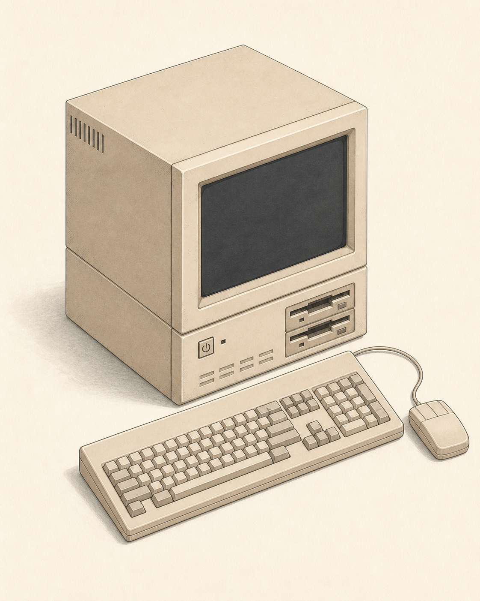
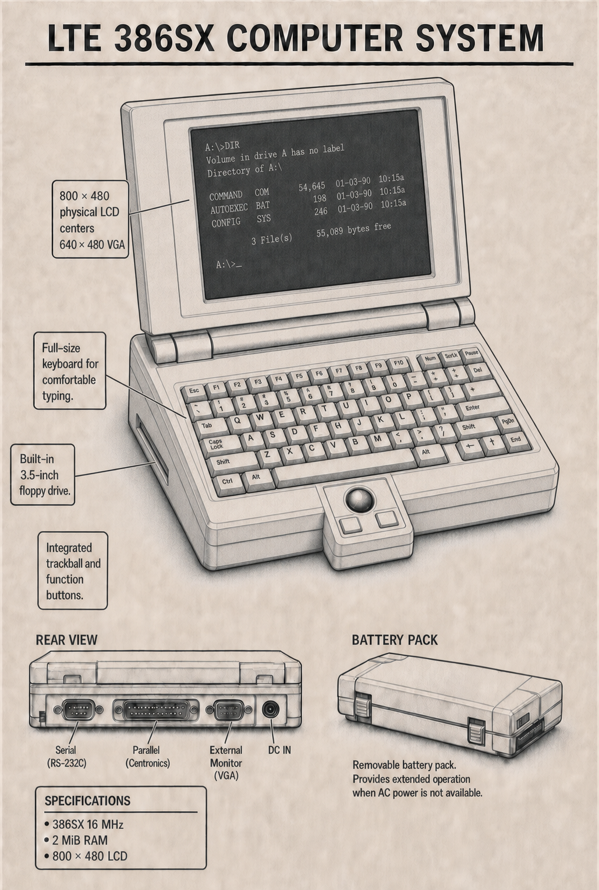

# Computer System

Computer System is a ComputerCraft-inspired programmable computer add-on for
Minecraft Bedrock Edition.

The project aims to reproduce the ComputerCraft experience as closely as the
Bedrock Add-On and Script APIs allow. Desktop programs can use a sandboxed,
MicroPython-compatible language called Computer System Python. The portable DOS
profile instead supports ASM, C, C++, BASIC, and bounded batch programs. The
computer lifecycle, terminal, filesystem, events, networking, peripherals,
portable computers, and turtles follow ComputerCraft-style behavior.

<table>
  <tr>
    <td align="center"></td>
    <td align="center"></td>
  </tr>
  <tr>
    <td align="center"><b>Desktop Computer System</b><br>Linux-style workstation concept</td>
    <td align="center"><b>Portable Computer System</b><br>386SX 16 MHz / 2 MB DOS mobile concept</td>
  </tr>
</table>

The Web Terminal Manual's architecture chapter also includes the authored
machine plates in `web/assets/machines/` and the CS386SX, CS486DX, and CS486DX2
identification plates in `web/assets/cpu/`. The machine plates remain the single
source for the pack's 256 px transparent inventory icons; the build performs a
bounded conversion instead of maintaining separate hand-copied textures.

## Status

The Phase 2 Bedrock Computer vertical slice is implemented. The language, VM,
scheduler, computer lifecycle, terminal model, filesystem, persistence, redstone
adapters, portable computer identity, monitor fallback, and bounded Bedrock
probes are covered by host and Bedrock Dedicated Server verification.

The repository also includes a local stdio MCP companion that can build the
packs, run an isolated BDS instance, execute allowlisted Computer System probes,
return bounded server logs, acquire a computer-scoped one-use Web handoff, and
execute bounded non-TUI shell commands inside an exact `c-xxxxxx` Computer. The
real MCP-to-BDS headless workflow passes with zero diagnostics.

The production interaction path uses the local Web Terminal companion. It does
not fall back to the native in-game terminal when the companion is unavailable;
instead, it reports an explicit retryable error. Using a Portable Computer
System activates its permanent four-digit connection number for two minutes and
connects the browser directly to the same fixed-cell terminal model. The Web
Terminal provides a full-width Linux-style screen, inline cursor-positioned
input, physical Enter, selection-aware copy and Ctrl+C, bounded plain-text
paste, and command history without relying on Bedrock's narrow CustomForm
container. Interactive commands use a targeted bounded snapshot path, so their
visible response does not wait for every viewer in the periodic round-robin.

On the DOS profile, `EDIT [path]` opens an original DOS-era full-screen editor.
Running `EDIT` by itself starts an `UNTITLED` buffer backed by `C:\NONAME.TXT`.
It provides a blue fixed-cell editing surface, File/Edit/Search/Options/Help
menus, cursor navigation, insert/overwrite modes, bounded undo and search,
F2/Ctrl+S save, and an explicit Save/Discard/Cancel exit state. `vi` remains the
syntax-highlighted modal editor for Linux and DOS; Linux deliberately does not
expose `EDIT`. Both editors use the same writer-owned bounded key transport and
resize with the negotiated Web Terminal grid.

The Web Terminal header also opens a searchable, keyboard-navigable 16-chapter
field manual. It is organized as a learning path rather than a command cheat
sheet: machine orientation and architecture; terminal, Bash, and storage;
MicroPython, its native API, Redstone, and a complete controller exercise;
assembly, BASIC, C/C++, and optimization; then DOS compatibility, diagnostics,
and the limits/glossary appendix. Previous/next controls and arrow keys follow
that publication order.

See [the implementation roadmap](docs/roadmap.md) for the planned compatibility
scope and executable acceptance criteria.

Development setup and Phase 0 evidence are documented in
[the development guide](docs/development.md) and
[the feasibility matrix](docs/feasibility-matrix.md). Player-experience checks
are intentionally isolated in the
[manual verification checklist](docs/manual-verification.md).

## Requirements

- Node.js 24 or later
- Minecraft Bedrock Edition 1.26.30 or later in the 1.26 release line
- The official Bedrock Dedicated Server distribution for BDS verification

The current package baseline uses `@minecraft/server` 2.8.0,
`@minecraft/server-ui` 2.1.0, and `@minecraft/vanilla-data` 1.26.33.

## Quick start

```powershell
npm install
npm run validate
```

`npm run validate` checks formatting, lint, TypeScript types, host tests, and
the production Behavior and Resource Pack build. Build artifacts are written
under `dist/`.

Useful development commands:

```powershell
npm run build
npm run deploy
npm run test:bds
npm run test:bds:disconnect
npm run test:mcp
npm run test:mcp:bds
npm run test:web
npm run dev:bds:web
```

`npm run deploy` updates only this project's development pack directories in the
local Minecraft for Windows GDK creator-content location.

## Bedrock MCP debugging

The Resource Pack is static client content and cannot host an MCP transport.
Instead, the project-scoped [`.codex/config.toml`](.codex/config.toml) registers
the `computer_system_bds` stdio companion implemented by
[`tools/bds-mcp-server.mjs`](tools/bds-mcp-server.mjs).

Set `BDS_HOME` to an extracted official BDS distribution. The tooling treats
that directory as a read-only source and copies it into a managed runtime under
`%USERPROFILE%\tmp\computer-system-bds`; it never recursively deletes
`BDS_HOME`.

```powershell
$env:BDS_HOME = "C:\path\to\bedrock-server"
npm run test:mcp:bds
```

For interactive work, start the MCP-managed server with the debug world
preserved, connect Minecraft to the reported port, and run player-scoped probes
through MCP. On Windows installations where Minecraft rejects `127.0.0.1` with
`InitialConnection-13`, use the machine's active LAN IPv4 address instead. See
[the MCP debugging guide](docs/mcp-debugging.md) for the complete workflow and
safety constraints.

`bds_execute_computer_command` provides a direct debug path for a specific
Computer without using its TUI. It returns stdout, stderr, exit code, and
modeled CPU cycles for the target Computer's persisted hardware model from the
sandboxed shell; it never invokes host PowerShell/Bash or arbitrary BDS
administration commands. `bds_wait_for_web_handoff` returns the next one-use URL
for one exact Computer ID while preventing browser auto-open from consuming it
first. Both paths bound input, concurrency, output, and waits. The MCP-only
`python <file>` and `micropython <file>` forms run a bounded source file with
the target Computer's MicroPython-compatible language, filesystem, hardware
profile, and RAM limit. Python is compiled to CS486 control flow and an
allowlisted managed-runtime syscall ABI; there is no separate Python VM. MCP
execution rejects waits and long-running work and reports machine instructions,
CPU cycles, and virtual time at the target Computer's clock, using the same
units as `run --stats`.

## Browser terminal

Start the combined BDS and Web Terminal companion, then connect Minecraft to the
reported Minecraft address and port:

```powershell
$env:BDS_HOME = "C:\path\to\bedrock-server"
$env:WEB_COMPANION_AUTO_OPEN = "1"
npm run dev:bds:web
```

With `WEB_COMPANION_AUTO_OPEN=1`, interacting with a Desktop or Advanced Desktop
Computer System activates browser access only when exactly one Monitor is
physically adjacent. A bare desktop is selected but does not expose Web
Terminal. The Portable Computer System has a built-in display and opens the link
while held or placed without an external Monitor. The companion advertises a
stable LAN entry page and Minecraft prints the Computer's permanent four-digit
number. Touching the machine activates that number once for two minutes. Invalid
codes are rate-limited per client, and a simultaneous four-digit collision fails
explicitly rather than connecting the wrong Computer. Opening the entry page and
entering the active number exchanges it for a browser-only bearer token that is
never written to BDS logs. The authenticated session lasts at most 30 minutes.
Placed machines remain usable only while that player stays within three blocks;
leaving the radius finalizes the session as `out_of_range`. A held Portable is
the access point itself and does not use the placed-block distance check. If the
companion does not answer within 10 seconds, the add-on opens the native in-game
terminal instead.

Each two-minute activation is already bound to one Computer; the companion root
page accepts only an active four-digit number, not an arbitrary Computer ID.
Newly created Computers use compact IDs in the form `c-xxxxxx`, where the
six-character lowercase Crockford Base32 payload is also the stable 30-bit value
returned by `os.getComputerID()`. Allocation checks the persisted identity
registry and retries collisions up to a fixed limit before failing explicitly.

Only one browser session can type into a given Computer at a time. The first
newly opened session receives `CONTROL` and atomically demotes the previous
writer to `VIEW ONLY`. A demoted viewer can use **Take control** to reclaim the
lease. Input and interrupts from viewers are rejected by both the companion and
Bedrock bridge, and closing one view does not emit `terminal_closed` while
another view of the same Computer remains active. Different Computers remain
independently writable.

The BDS Web companion listens on `0.0.0.0:19144` by default and chooses a
non-virtual LAN IPv4 address for the entry page. Trusted LAN clients therefore
need TCP 19144 in addition to the BDS UDP port. Override the detected address
when the host has unusual routing:

```powershell
$env:WEB_COMPANION_PUBLIC_HOST = "192.168.1.10"
npm run dev:bds:web
```

Minecraft/BDS and the Web Terminal use different transports: the managed BDS
defaults to UDP 19142, while the browser companion defaults to TCP 19144. For
Internet access, keep the companion bound to loopback and put an HTTPS reverse
proxy on TCP 443 in front of it:

```powershell
$env:WEB_COMPANION_HOST = "127.0.0.1"
$env:WEB_COMPANION_PUBLIC_ORIGIN = "https://terminal.example.com"
npm run dev:bds:web
```

Do not expose the plain HTTP companion port directly to the Internet. The
reverse proxy should terminate TLS and forward only to `127.0.0.1:19144`.

## CS-Linux and CS-DOS

Terminal commands execute inside the Computer System sandbox, never in the host
Windows or BDS process. Computer System Linux 1.0 (`CS-Linux 1.0`) boots a
non-destructive Linux profile with `/etc`, `/dev`, `/tmp`, `/usr`, `/var`, and
`/home/computer`. Existing files are preserved while `/tmp` is explicitly
volatile. On first boot it requires the `computer` administrator password twice;
later boots stop at `Password:` until it matches. The bounded salted SHA-256
record is stored in `/etc/shadow`, never the plaintext, and Web input is masked,
excluded from local history, and excluded from completion. Three failed attempts
incur a two-second guest delay. A profile boundary separates path syntax, boot
layout, command aliases, environment, and virtual devices. The implemented DOS
profile shares the same terminal, filesystem, persistence, hardware limits, and
checked CS executable/toolchain abstractions without Linux conditionals in the
domain core. It provides drive-letter paths, case-insensitive lookup, CRLF boot
files, `NUL`/`CON`, and DOS command aliases including `DIR`, `TYPE`, `COPY`, and
`VER`. Computer System DOS 6.2 (`CS-DOS 6.2`) reads a bounded `CONFIG.SYS` and
runs `AUTOEXEC.BAT`; `SET`, `PATH`, `PROMPT`, `REM`, `@ECHO OFF`, `%0`…`%9`,
`%VAR%`, and `%ERRORLEVEL%` are supported. Unsupported boot directives fail
visibly.

```text
files:  pwd cd ls cat mkdir touch rm cp mv find stat df du quota
text:   echo printf head tail wc grep sort uniq tr cut seq
shell:  sh bash source env export unset which type
info:   whoami id hostname uname date uptime cpuinfo free
system: clear vi history time sleep test [ shutdown reboot exit true false
DOS:    EDIT plus drive/path/environment compatibility commands
toolchain: as cc c++ basic basicc ld nm run objdump
```

The parser supports single and double quotes, backslash escapes, environment
variables, `$?`, pipelines (`|`), input/output redirection (`<`, `>`, `>>`), and
control operators (`&&`, `||`, `;`). Computer System Bash adds shebangs,
positional parameters, conditionals, bounded loops, functions,
`break`/`continue`/`return`, and `source`. It loads `/etc/bash.bashrc` and then
`~/.bashrc` without replacing existing user files. Command length, tokens,
pipeline stages, script depth/lines/iterations, and intermediate output are
limited so shell work cannot become an unbounded server load path. This is a
sandbox implementation and never invokes host Bash.

`vi <path>` uses Normal, Insert, and Command modes and supports bounded cursor
movement, `dd`, `x`, undo, `:w`, `:q`, `:wq`, `:wq!`, `:q!`, and Shift+ZZ.
Python, shell, JSON/TOML tokens are highlighted, and indentation rainbow
backgrounds are on by default. The native terminal remains 51x19; the Web
Terminal negotiates a viewport up to 160x60 from the available screen and
resizes `vi` with it. The browser subtracts terminal padding and fits both rows
and columns, so the terminal surface does not expose an internal scrollbar. The
browser coalesces up to 16 keys per relay, while the BDS boundary rejects
batches above 32 keys. Tab performs bounded command/path completion through the
same writer-authorized relay.

Computer snapshots remain canonical in Bedrock World Dynamic Properties, which
BDS stores in the world's LevelDB. Clean persistence checks compare O(1)
component revisions instead of serializing the whole snapshot. Filesystem child
lookups use a parent index, capacity is cached, and transactional storage keeps
only the current and previous complete generations. SQLite is intentionally not
the BDS source of truth because Bedrock Script API cannot access it directly; a
future non-Bedrock host can add a SQLite repository behind the same boundary.
`quota` reports the enforced capacity, per-file, and entry limits; `du` computes
bounded subtree usage from one filesystem snapshot. `date` defaults to wall UTC,
with `date --game` and `date --virtual` for Minecraft and deterministic VM time.
Both profiles keep four-digit UTC years without a two-digit-year pivot,
represent the 2000 leap day correctly, and support timestamps beyond the signed
32-bit 2038 boundary.

Each Computer also has a persisted virtual hardware profile. Desktop Computer
Systems default to a Computer System 486DX at 33 MHz with 2 MiB RAM. Advanced
Desktop Computer Systems use a Computer System 486DX2 at 66 MHz with 8 MiB RAM.
Portable Computer Systems default to DOS on a Computer System 386SX at 16 MHz
with 2 MiB RAM. At 20 server ticks per second those profiles receive at most
1,650,000, 3,300,000, and 800,000 modeled CPU cycles per tick respectively,
while the scheduler retains the same global cap and round-robin fairness across
Computers. The 386SX profile uses Intel 80386-derived instruction clocks,
value-dependent early-out multiplication, taken/not-taken branch costs, and
explicit penalties for four-byte RAM and stack transfers over its 16-bit data
bus. Timing dispatch remains O(1) per instruction.

On CS486DX and CS486DX2 desktop machines, Computer System Python compiles
branches, calls, returns, and waits to the same validated process representation
and uses bounded `python` syscalls for managed values and native modules. The
selected CPU model owns instruction timing; collection and call costs still
scale with their input size. Native shell commands and Bash scripts currently
use the separate shell interpreter but return bounded CPU-cycle charges, so they
cannot bypass the same budget. Former 20 kHz snapshots migrate to the standard
desktop default when restored. An Advanced Computer record still using a known
standard desktop default migrates once to the CS486DX2 profile. A legacy-default
portable record migrates once at the portable item boundary; any customized OS,
CPU, clock, or RAM configuration remains authoritative. Standard and portable
machines install 2 MiB RAM; the Advanced Desktop installs 8 MiB. Aggregate
runtime data raises `MemoryError` on overflow, while unreachable values are
reclaimed during pressure checks. Linux exposes its 32-bit protected flat
sandbox through `cpuinfo`, `free`, `/proc/cpuinfo`, and `/proc/meminfo`; paging,
swap, and a process/MMU model are not claimed. DOS exposes `CPU`, `MEM`,
`MEM /C`, `MEM /D`, and `SYSTEMINFO`. Its 2 MiB view accounts for 640 KiB
conventional memory, bounded UMB/reserved regions, and XMS/HMA state configured
by the modeled `HIMEM.SYS`, `EMM386.EXE NOEMS`, and `DOS=HIGH,UMB` directives.
This is protected sandbox/v86 compatibility metadata, not native BIOS/DOS
interrupt or `.COM` / `.EXE` emulation. RAM, persistent disk quota, collection
size, and output bounds are independent limits.

The sandboxed CS486 toolchain adds real 32-bit `EAX` through `EBP` registers,
checked little-endian linear memory, stack/call control flow, terminal CPU
faults, and model-specific instruction cycle costs. `as`, `cc`, `c++`, and
`basicc` compile safe initial language subsets to the same validated textual
executable format. `as`, `cc`, `c++`, and `basicc` accept `-c` to emit a bounded
`CS486OBJ` relocatable object. Objects carry text symbols, text-target
relocations, and object-relative data size; `ld` resolves them into the existing
validated `CS486` executable in O(instructions + symbols + relocations) work.
`nm` and `objdump` inspect both formats. C and C++ support external and defined
zero-argument integer functions plus statement-boundary `asm("...")`; inline
assembly rejects labels, control flow, stack operations, and ESP/EBP access.
Desktop Python resolves same-directory modules followed by `/lib/python` and
`/usr/lib/computer-system/python`. A `.py` module is compiled and initialized
once; a versioned `.o` `CS486OBJ` module exposes its global zero-argument
integer functions as Python attributes and executes them in the same CS486
process with EAX returns. For example, `cc -c fastmath.c -o fastmath.o` beside a
script enables `import fastmath`. Missing, circular, oversized, corrupt, or
ABI-incompatible imports fail explicitly. `basic` runs BASIC source directly,
while `run --stats` reports the active CS486DX, CS486DX2, or CS386SX model,
instructions, CPU cycles, and virtual microseconds at its persisted clock. No
frontend invokes a host compiler, linker, or native binary. General
dynamic/shared libraries remain a follow-up on the versioned object and ABI
foundation. MCP's `cpuCycles` field uses one unit across ASM, C, C++, BASIC, and
desktop Python; machine-instruction counts remain diagnostic values, not timing
units. The portable CS386SX retains ASM, C, C++, BASIC, and batch support, but
rejects user `python`/`micropython` debug commands with status 127 and does not
execute `/startup.py`.

The Bedrock pack includes placeable `Computer`, `Advanced Computer`, and
`Monitor` items (`computer_system:computer_item`,
`computer_system:advanced_computer_item`, and `computer_system:monitor`). Their
inventory icons are generated from the authored machine plates. The Portable
Computer System uses the matching authored plate as its held-item icon and can
transfer that identity into the placeable
`computer_system:portable_computer_block`; breaking it returns the same identity
to an item. Placed blocks use internal `computer_system:computer_00..63` or
`computer_system:advanced_computer_00..63` identifiers for their six-face
redstone-output mask. Desktop Web Terminal access requires exactly one
physically adjacent `computer_system:monitor`; missing or ambiguous connections
fail explicitly. The current display block is named Monitor rather than Display.
`computer_system:portable_computer` is the portable DOS item and applies the
CS386SX 16 MHz / 2 MiB profile when its persistent identity is created or a
legacy-default portable identity is safely migrated.

Examples:

```sh
ls -la /
printf 'alpha\nbeta\nalpha\n' | grep alpha | wc -l
echo 'hello world' > message.txt
cat message.txt | tr a-z A-Z
false || echo recovered
bash -c "find / -name '*.py' | sort"
```

This is an intentionally sandboxed compatibility shell, not a host process
launcher. Unsupported applets return a normal `command not found` status rather
than escaping into PowerShell, `cmd.exe`, or the BDS host.

## Repository layout

- `src/domain/`: Minecraft-independent language, VM, filesystem, terminal, and
  device rules
- `src/application/`: lifecycle, OS, runtime, and service orchestration
- `src/bedrock/`: Minecraft Script API adapters and terminal coordination
- `packs/`: Behavior Pack and Resource Pack source assets
- `tools/`: build, deploy, BDS, probe, and MCP tooling
- `tests/`: host, pack, Bedrock adapter, and tool tests
- `docs/`: roadmap, development notes, evidence, and verification checklists

## Planned platform

- Minecraft Bedrock Edition
- Behavior Pack and Resource Pack
- TypeScript compiled to the Bedrock Script API runtime
- A deterministic, instruction-budgeted Python virtual machine
- Vitest-based host-side unit and compatibility tests

## License

No license has been selected yet. All rights are reserved until a license is
added.
