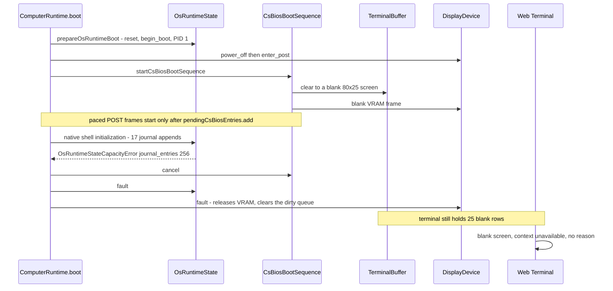
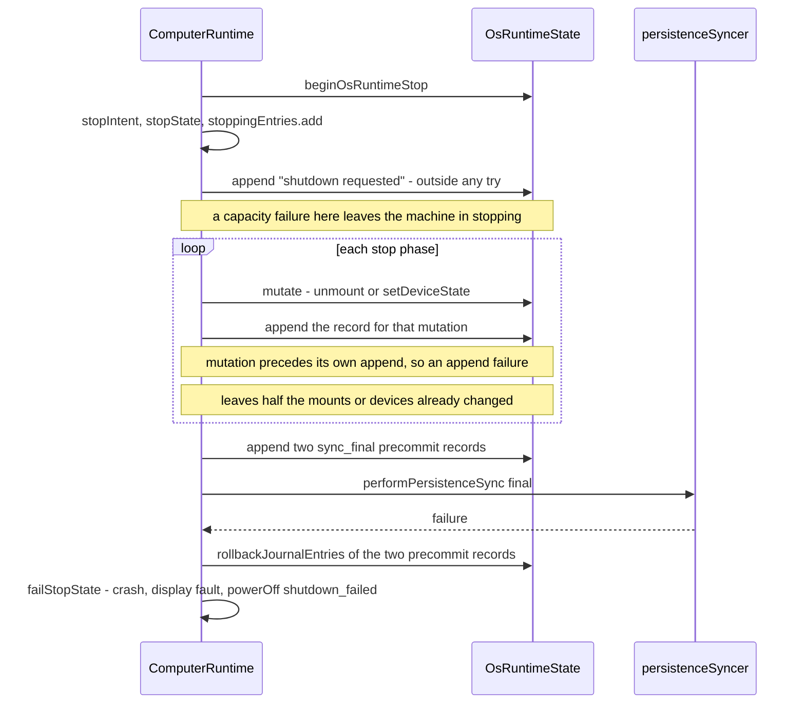
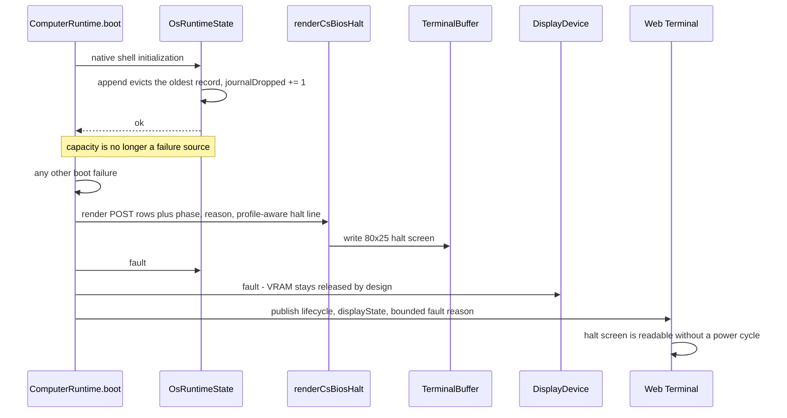

# Issue #112: Bounded rotating OS runtime journal and visible CSBIOS boot failure

GitHub Issue: https://github.com/tsuyoshi-otake/computer-system/issues/112

Status: planned. Root cause and every path below are confirmed by reading the
current `main` sources and by one observed live managed-BDS occurrence; no code
change has been made yet. Related: #111 (implemented, its remaining real-session
acceptance item is blocked by this defect on the affected Computer), #108
(different root cause, keeps its own scope), #20 (OS presence lifecycle), #39
(login text and last-login history).

## Reported symptom

Observed 2026-07-25 on the live managed BDS world running the current `main`
build with the operator-selected `wasm-rust` compute engine. A Computer was
`lifecycle: "crashed"` and `displayState: "faulted"`, all 25 terminal rows were
blank, and the published descriptor reported `context: "unavailable"` with
`inputMode: "none"`. Nothing on screen explained why. A `safe_boot` request
returned the reason only as a command error:

```text
OS runtime journal_entries capacity 256 exceeded [boot phase: native shell initialization]
```

Two independent defects, one observation: a diagnostic log that is fatal when
full, and a boot failure that is invisible on every surface.

## Defect 1: the OS runtime journal is capped without rotation

- `OsRuntimeState.appendJournal` throws `OsRuntimeStateCapacityError` as soon as
  the record count reaches `maximumJournalEntries` (256), and again when the
  message would push the total past `maximumJournalBytes` (32 KiB). No eviction
  exists anywhere; the only removal is the transactional rollback splice.
  `restoreJournal` throws the same two errors for an over-cap snapshot, so a
  Computer that reached the cap cannot even be restored.
- The journal is persisted per Computer inside
  `PersistedOsRuntimeStateSnapshot`, so it accumulates across power cycles,
  reloads, and migrations. Login, logout, service transitions, cron warnings,
  shutdown records, and `terminal_closed` finalization all append to it.
- `ComputerRuntime.boot()` reaches the `native shell initialization` phase,
  where `ensureLinuxRuntimePresence` appends the kernel-start line, the
  CPU/memory line, the PID 1 line, and one line per mount. With a full journal
  the first append throws, so boot fails into `crash`,
  `faceIo.powerOff("boot_failed")`, and a display `fault`. `safe_boot` runs the
  same path and fails identically, which makes the Computer permanently
  unbootable without a code change.

A bounded diagnostic log reaching its documented limit must never be fatal. The
sibling monotonic log in this codebase already behaves correctly:
`.bash_history` drops its oldest entry on append and keeps only the newest 100
on load. The OS runtime journal is the outlier, and `/var/log/messages`,
`/var/log/auth.log`, and `dmesg` are precisely the surfaces a real system
rotates.

`startLoginSession` has the same shape: the 65th distinct username exceeds
`maximumLastLogins` (64) and makes login itself throw, even though `last` is a
history view rather than a structural table.

## Defect 1b: the shutdown path can create the condition and hides it

The brick is reachable from a healthy running machine, not only from boot:

- `requestStop` appends `<shutdown|reboot> requested: <reason>` outside any
  `try`, after `beginOsRuntimeStop`, the stop intent, the stop state, and
  `stoppingEntries.add(entry)` have already been committed. A full journal
  therefore throws with the machine left in `stopping`, which contradicts the
  repository rule that capacity-plus-one must fail without partial state change.
- `advanceStopState` wraps its phases, so an append failure inside a stop phase
  routes to `failStopState` and the machine ends `crashed` instead of `off`.
  This is the most likely way an ordinary session produces an unbootable
  Computer.
- `failStopState` deliberately swallows failures from its own `critical`
  `appendSystemJournal`, so the record that documents the failure is lost
  exactly when the log is full.

## Defect 2: a boot failure is invisible on every surface

- `boot()` performs shell construction, startup-source selection, Python
  preparation, guest-memory admission, PID 1 creation, and scheduler admission
  synchronously **before** the CSBIOS sequence renders a single paced frame. The
  `CsBiosRenderer` constructor clears the terminal and writes a blank 25-row
  screen (`power_on_black`); POST frames only begin once the entry is added to
  `pendingCsBiosEntries`, which the failing paths never reach.
- `DisplayDevice.transition({ kind: "fault" })` then releases VRAM and clears
  the dirty queue by design, so the graphics path has nothing to show either.
- The reason exists only in `RuntimeCommandResult.error`. `webTerminalBridge`
  publishes `lifecycle` and `displayState` as kinds without a message, and the
  in-game crashed branch prints a generic chat line.

The result is an unexplained black screen on a machine that has already computed
a precise, bounded reason.

## Portable CS386SX and CS-DOS

- **CS386SX + CS-Linux bricks identically.** The failing appends live in
  `ensureLinuxRuntimePresence`, which is CPU-model independent, so the hardware
  profile changes nothing about defect 1.
- **CS-DOS cannot brick this way today.** `prepareOsRuntimeBoot` creates PID 1
  as `C:\COMMAND.COM` without appending, and no DOS equivalent of
  `initializeLinuxRuntimePresence` exists. A Computer migrated from CS-Linux to
  the Portable DOS profile still carries its persisted journal as dead weight
  that no DOS surface renders.
- **Floppy boot is structurally immune.** It builds a fresh transient
  `OsRuntimeState`, so the persisted journal is not consulted.
- **Safe boot means something different on a Portable machine.** `safe_boot` is
  not gated by CPU or OS profile, but its `/startup.py` bypass applies only when
  `supportsMicroPython && profile === "linux"`, and `cs386sx` has
  `supportsMicroPython: false`. On a Portable machine the only real effect is
  skipping a bootable floppy. The existing in-game crashed line ("Sneak while
  opening it to safe boot without changing /startup.py") is therefore already
  false there, and the manual's safe-boot prose describes only the desktop case.
- Hardware rows need no special casing: `formatCache` already returns `None`
  when both cache sizes are 0, and the panel row already reports the portable
  LCD.
- No `GuestRamLedger`, `InMemoryFilesystem`, or block-I/O accounting changes are
  required, and nothing here is part of the CS486 contract shared with the Rust
  wasm batch executor, so no `Cs486Process`-versus-wasm equivalence obligation
  applies.

## Logic order review

The ordering below was walked call site by call site before writing any code.
Two of the diagrams changed the planned design, and one exposed a second
unbootable state that the first design pass had missed.

### How fast the cap is actually reached

Counted from the append call sites, not measured at runtime. A warm CS-Linux
desktop boot with no floppy appends 17 records: kernel start, the CPU/memory
line, four mounts, six device discoveries, two rc.d services, the `cs-login`
line, the account-database line, and `boot complete`. Active mounts and
`available` device states are volatile, so `clearVolatileState` drops them on
every cold restore and those ten records repeat on every boot. A graceful
shutdown appends 17 more: the stop request, the signal phase, work finalized,
block I/O drained, the data-sync result, four unmounts, six device stops, and
the two final-sync precommit records. Logins add auth records on top.

One power cycle therefore costs roughly 35 of the 256 records, so the entry cap
is reached in about seven power cycles, and it binds long before the 32 KiB byte
cap. That is why a world in ordinary use reached the limit within days rather
than after a long life.

### Boot order today



The failure is ordered strictly between the blank screen and the first paced
frame, which is exactly why nothing is ever rendered. The reason exists only in
the returned `RuntimeCommandResult`.

### Stop order today



`failStopState` swallows its own `critical` append, so the record explaining the
failure is lost precisely when the journal is full.

### Planned order



### Gaps the ordering review exposed

1. **A sequence gap is not observable to the guest.** `renderJournalEntries`
   prints `[tick] channel.severity: message` and never the sequence number, so
   the first design's "observable as a sequence gap" claim was wrong for
   `dmesg`, `/var/log/messages`, and `/var/log/auth.log`. Rotation therefore
   needs an explicit bounded `journalDropped` counter in the state, rendered as
   one leading notice line in the journal views, carried in both snapshots,
   accepted as absent by older snapshots, and added to the snapshot key
   allowlist. Silent loss is not acceptable for a security-relevant log.
2. **Eviction interacts with the `sync_final` precommit rollback.**
   `rollbackJournalEntries` throws `entry does not belong to this journal` when
   a requested entry is missing, and it rejects byte underflow. Once appends can
   evict, a precommit record can already be gone, and the rollback error would
   then mask the real persistence failure through the
   `final precommit rollback failed` wrapper. Rollback must skip entries that
   are no longer present, adjust accounting only for what it actually removed,
   and keep the original failure authoritative.
3. **Truncating restore must not break the snapshot's own integrity checks.**
   `restoreJournal` compares the persisted `journalBytes` against the recomputed
   sum and rejects a mismatch, and the following `nextJournalSequence` check is
   bounded below by the last retained sequence. The correct order is: parse and
   validate every entry, validate the persisted byte total against the full sum,
   then drop oldest-first, then set the live byte count from the retained
   records. Dropping the newest records instead would invalidate
   `nextJournalSequence`, which is a second reason eviction must be
   oldest-first.
4. **There are four display-fault sites, and only three should show a halt
   screen.** `boot()`'s catch, the CSBIOS handoff catch, and `failStopState` all
   end with an uninformative screen and must share one halt-screen renderer. The
   guest-crash path must not: the guest has already written its own error
   output, and overwriting it would destroy the better diagnostic.
5. **The CSBIOS handoff failure leaves a second unbootable state.** That catch
   faults the display and crashes the Computer but never calls `faultOsRuntime`,
   so the OS runtime stays `running`. The next power-on or safe boot reaches
   `prepareOsRuntimeBoot`, which throws `OS runtime cannot boot while running`,
   and the machine crashes again with the same blank screen. Unlike the journal
   defect this one is session scoped, because `persistentSnapshot` writes the
   cold lifecycle as `off`, so a reload clears it. It belongs to this Issue
   because it is the same "unbootable with no explanation" surface.
6. **Mutation must not precede its own record.** The `unmount` and
   `stop_devices` phases mutate state and then append the record describing it,
   so an append failure leaves a partially unmounted machine. Rotation removes
   capacity as a failure source for those appends, which is what makes the
   remaining order safe; the ordering rule still needs to be written down so a
   later append is not added after a mutation again.

## Planned change

### A. Bounded rotating journal and last-login history

- `appendJournal` evicts oldest-first instead of throwing, for both the entry
  cap and the byte cap, in O(1) amortized with exact byte accounting.
  `nextJournalSequenceValue` keeps advancing monotonically, so retained
  sequences stay strictly increasing.
- Eviction is counted, not inferred. A bounded `journalDropped` counter lives in
  the state, is carried by both `snapshot()` and `persistentSnapshot()`, is
  added to the snapshot key allowlist, and defaults to 0 when an older snapshot
  omits it. `renderJournalEntries` prints `[tick] channel.severity: message` and
  no sequence number, so a sequence gap is invisible to `dmesg`,
  `/var/log/messages`, and `/var/log/auth.log`; the counter is surfaced as one
  leading notice line in those views instead. Silent loss is not acceptable for
  a log that carries authentication records.
- `restoreJournal` drops oldest records until the snapshot fits both caps
  instead of throwing. This is what recovers an already-affected Computer, and
  it must be restart idempotent. The order matters: validate every entry, then
  validate the persisted `journalBytes` against the sum of all parsed entries,
  then drop oldest-first, then set the live byte count from the retained
  records. Dropping oldest also keeps the last retained sequence intact, which
  the `nextJournalSequence` range check depends on.
- Transaction rollback restores records evicted inside that transaction, so a
  failed transaction still observes the pre-transaction journal. Rollback must
  also tolerate a requested entry the ring has already evicted: skip it, adjust
  accounting only for what was actually removed, and never turn that into an
  error, because `advanceStopState` wraps a rollback failure into
  `final precommit rollback failed` and would mask the real persistence failure.
- `last_logins` rotates the same way instead of failing the 65th distinct
  username.
- Structural cold state keeps failing explicitly: services, mounts, devices,
  processes, jobs, and PID space are fixed tables, and their capacity errors are
  the correct response to malformed or over-cap persisted input.

### B. Visible boot failure

- Render a CSBIOS-style halt screen into `TerminalBuffer` before the display
  `fault` transition. The fixed-cell terminal is the text source of truth for
  the opened terminal view, which is both the Web Terminal and the in-game
  terminal form, and that view renders `record.terminal` even while `crashed`,
  so one write covers both. VRAM is deliberately not written and the block-face
  display stays dark, because `fault` releases VRAM by design.
- Exactly one renderer owns that screen, and three call sites share it: the
  `boot()` catch, the CSBIOS handoff catch, and `failStopState`. The guest-crash
  path is deliberately excluded: the guest has already written its own error
  output to the terminal, and overwriting it would destroy the better
  diagnostic.
- Reuse the factual `postScreen` rows for the part of POST the machine actually
  reached, then add the failing phase, the reason wrapped into at most two
  80-column lines, and a halt line. No fabricated hardware and no invented
  progress.
- The recovery line is CPU/profile aware: the `/startup.py` sentence only when
  `supportsMicroPython && profile === "linux"`, the floppy-skip sentence when a
  bootable floppy is present, otherwise a halt line with no recovery claim.
- Publish the bounded fault reason in the Web frame metadata. The companion
  stores and re-emits the published payload verbatim and
  `requirePublishedTerminalInteraction` validates only the `interaction`
  sub-object, so no interaction-schema bump and no companion change are needed;
  a test must lock that the added field does not trip the validator.
- Apply the same profile-aware wording to the in-game crashed chat line.
- Move `requestStop`'s journal append so a capacity or validation failure cannot
  leave a machine in `stopping`, and keep `failStopState` authoritative about
  the original phase failure. Record the ordering rule that a phase must not
  mutate state before appending the record that describes that mutation.

### C. The CSBIOS handoff must fault the OS runtime it started

The handoff catch cancels the sequence, faults the display, and crashes the
Computer, but it never calls `faultOsRuntime`, so the OS runtime stays `running`
after the presence initialization that ran just before it. The next power-on
reaches `prepareOsRuntimeBoot`, which accepts only `faulted` or `off` and throws
`OS runtime cannot boot while running`, so the machine crashes again to the same
blank screen. This is a second unbootable state with no explanation, which is
why it belongs here; it is session scoped rather than persistent, because
`persistentSnapshot()` writes the cold lifecycle as `off` and a world or chunk
reload therefore clears it. The fix is to fault the OS runtime on that path like
every other terminal failure path already does.

## Acceptance

Verify: `npm exec vitest run tests/os/osRuntimeState.test.ts`.

Expect: Appending at the entry cap and at the byte cap keeps the newest record,
drops the oldest, leaves byte accounting exact, keeps retained sequences
strictly increasing, and increments `journalDropped` by the number of records
actually evicted. Rendering the journal after an eviction shows the
dropped-record notice. Rolling back a transaction whose entries are still
present restores them; rolling back a transaction whose oldest entry was already
evicted succeeds, removes only what is present, and does not throw. Restoring a
snapshot whose journal exceeds either cap truncates oldest-first, accepts the
snapshot's own full byte total, reports the retained byte total afterwards, and
restoring the truncated snapshot again produces an identical state. A snapshot
without `journalDropped` restores with 0. A 65th distinct username rotates
`last_logins` instead of throwing. Service, mount, device, process, job, and PID
capacities still fail explicitly.

Verify: `npm exec vitest run tests/computer tests/os`.

Expect: A Computer restored from a full or over-cap journal snapshot boots to
`running` on CS486DX/CS486DX2 and on CS386SX + CS-Linux; restoring the truncated
snapshot again is idempotent; the CS-DOS and floppy-boot paths keep their
current behavior; a stop request on a full journal either completes or fails
without leaving the machine in `stopping`.

Verify: focused boot-failure tests over the terminal snapshot.

Expect: A failed boot leaves POST rows, the failing phase, and the bounded
reason readable in the terminal buffer. The Portable CS386SX case shows
`CS386SX`, `Cache : None`, the portable panel row, and no `/startup.py` recovery
claim; the desktop CS-Linux case does show it. A CSBIOS handoff failure and a
failed shutdown produce the same halt screen, while a guest VM crash leaves the
guest's own error output on screen untouched.

Verify: focused tests over a failed CSBIOS handoff followed by a second power-on
in the same session.

Expect: The handoff failure leaves the OS runtime `faulted`, and the next
power-on boots to `running` instead of failing with
`OS runtime cannot boot while running`.

Verify: `npm run validate`.

Expect: Formatting, lint, TypeScript, all host tests, the Bedrock pack build,
and the 16-chapter Pages build pass.

Verify: Managed BDS. Restart the companion on the fixed build with the preserved
world (`resetWorld: false`), power on the affected Computer, then read the
screen with `bds_get_tui_screen` and assert the halt-screen literals on a
deliberately failed boot with `bds_verify_tui_screen`.

Expect: The previously unbootable Computer reaches `running` with its
filesystem, accounts, and OS state preserved and its journal truncated to the
newest records; a failed boot shows the halt screen instead of a blank display.
Record the date, engine selection, and observed result here before the Issue
closes.

Verify: Real Web Terminal session in a browser on the fixed build.

Expect: The halt screen and the published fault reason are visible without a
power cycle, and the recovered Computer accepts input.

## Exclusions

- Deferring OS preparation until the CSBIOS handoff tick, so that a boot failure
  genuinely follows a watched POST sequence, is out of scope. It would remove
  `boot()`'s synchronous failure report and change the observable contract of
  every power-on caller.
- No change to the journal's per-entry byte limit, channel model, or rendering
  order, and no new log surface.
- The `wasm-rust` compute engine stays opt-in with `typescript` as the default;
  nothing here is p95 tick or #16 multi-user load evidence.

## Documentation to update with the implementation

- `web/manual.js` 4.10 states that the journal defaults to 256 records and 32
  KiB total; it must describe oldest-first rotation and the dropped-record
  notice that `dmesg` and `/var/log/messages` show once eviction has happened.
- `web/manual.js` 4.11, 9.6, and the chapter 15 troubleshooting row describe
  safe boot only in `/startup.py` terms; they must state what safe boot does on
  a Portable CS386SX/CS-DOS machine and mention the halt screen as the first
  thing to read after a failed boot.
- `src/application/os/` and `src/application/computer/` scoped guidance must
  record which capacities rotate and which stay fatal, so the distinction is not
  rediscovered per change.
