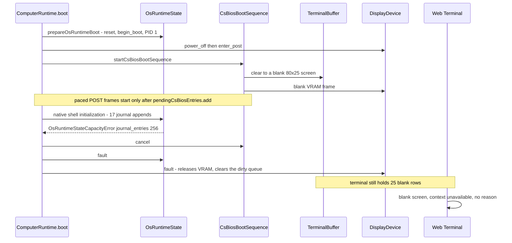
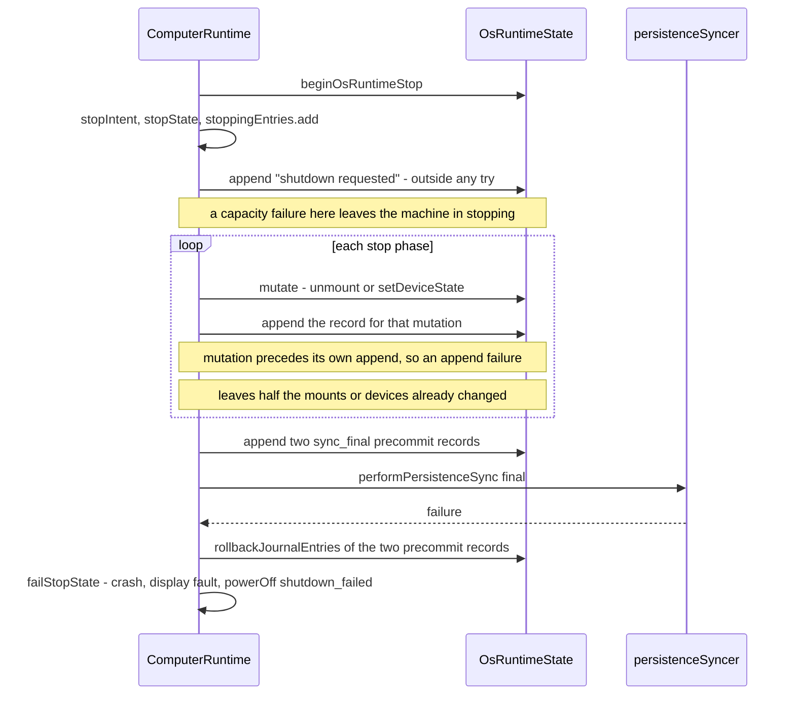
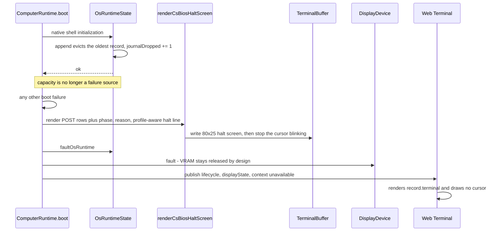

# Issue #112: Bounded rotating OS runtime journal and visible CSBIOS boot failure

GitHub Issue: https://github.com/tsuyoshi-otake/computer-system/issues/112

Status: implemented and host-verified 2026-07-25, deployed to the live managed
BDS world the same day. Changes A, B, and C below are in `main` with focused
tests, and the managed companion now runs the fixed build against the preserved
interactive world; the in-game power-on readback of the affected Computer and
the real-browser check are the only acceptance items still open, and they are
marked as such. Root cause and every path below were confirmed by reading the
sources and by one observed live managed-BDS occurrence before any code changed.
Two claims from the planning pass were wrong and are corrected in place below
(the Planned change C premise, and the Web frame-metadata item in B); the
original wording is kept alongside the correction rather than silently replaced.
Related: #111 (implemented, its remaining real-session acceptance item was
blocked by this defect on the affected Computer), #108 (different root cause,
keeps its own scope), #20 (OS presence lifecycle), #39 (login text and
last-login history).

## Reported symptom

Observed 2026-07-25 on the live managed BDS world running the current `main`
build with the operator-selected `wasm-rust` compute engine. A Computer was
`lifecycle: "crashed"` and `displayState: "faulted"`, all 25 terminal rows were
blank, and the published descriptor reported `context: "unavailable"` with
`inputMode: "none"`. Nothing on screen explained why. A `safe_boot` request
returned the reason only as a command error:

```text
OS runtime journal_entries capacity 256 exceeded [boot phase: native shell initialization]
```

Two independent defects, one observation: a diagnostic log that is fatal when
full, and a boot failure that is invisible on every surface.

## Defect 1: the OS runtime journal is capped without rotation

- `OsRuntimeState.appendJournal` throws `OsRuntimeStateCapacityError` as soon as
  the record count reaches `maximumJournalEntries` (256), and again when the
  message would push the total past `maximumJournalBytes` (32 KiB). No eviction
  exists anywhere; the only removal is the transactional rollback splice.
  `restoreJournal` throws the same two errors for an over-cap snapshot, so a
  Computer that reached the cap cannot even be restored.
- The journal is persisted per Computer inside
  `PersistedOsRuntimeStateSnapshot`, so it accumulates across power cycles,
  reloads, and migrations. Login, logout, service transitions, cron warnings,
  shutdown records, and `terminal_closed` finalization all append to it.
- `ComputerRuntime.boot()` reaches the `native shell initialization` phase,
  where `ensureLinuxRuntimePresence` appends the kernel-start line, the
  CPU/memory line, the PID 1 line, and one line per mount. With a full journal
  the first append throws, so boot fails into `crash`,
  `faceIo.powerOff("boot_failed")`, and a display `fault`. `safe_boot` runs the
  same path and fails identically, which makes the Computer permanently
  unbootable without a code change.

A bounded diagnostic log reaching its documented limit must never be fatal. The
sibling monotonic log in this codebase already behaves correctly:
`.bash_history` drops its oldest entry on append and keeps only the newest 100
on load. The OS runtime journal is the outlier, and `/var/log/messages`,
`/var/log/auth.log`, and `dmesg` are precisely the surfaces a real system
rotates.

`startLoginSession` has the same shape: the 65th distinct username exceeds
`maximumLastLogins` (64) and makes login itself throw, even though `last` is a
history view rather than a structural table.

## Defect 1b: the shutdown path can create the condition and hides it

The brick is reachable from a healthy running machine, not only from boot:

- `requestStop` appends `<shutdown|reboot> requested: <reason>` outside any
  `try`, after `beginOsRuntimeStop`, the stop intent, the stop state, and
  `stoppingEntries.add(entry)` have already been committed. A full journal
  therefore throws with the machine left in `stopping`, which contradicts the
  repository rule that capacity-plus-one must fail without partial state change.
- `advanceStopState` wraps its phases, so an append failure inside a stop phase
  routes to `failStopState` and the machine ends `crashed` instead of `off`.
  This is the most likely way an ordinary session produces an unbootable
  Computer.
- `failStopState` deliberately swallows failures from its own `critical`
  `appendSystemJournal`, so the record that documents the failure is lost
  exactly when the log is full.

## Defect 2: a boot failure is invisible on every surface

- `boot()` performs shell construction, startup-source selection, Python
  preparation, guest-memory admission, PID 1 creation, and scheduler admission
  synchronously **before** the CSBIOS sequence renders a single paced frame. The
  `CsBiosRenderer` constructor clears the terminal and writes a blank 25-row
  screen (`power_on_black`); POST frames only begin once the entry is added to
  `pendingCsBiosEntries`, which the failing paths never reach.
- `DisplayDevice.transition({ kind: "fault" })` then releases VRAM and clears
  the dirty queue by design, so the graphics path has nothing to show either.
- The reason exists only in `RuntimeCommandResult.error`. `webTerminalBridge`
  publishes `lifecycle` and `displayState` as kinds without a message, and the
  in-game crashed branch prints a generic chat line.

The result is an unexplained black screen on a machine that has already computed
a precise, bounded reason.

## Portable CS386SX and CS-DOS

- **CS386SX + CS-Linux bricks identically.** The failing appends live in
  `ensureLinuxRuntimePresence`, which is CPU-model independent, so the hardware
  profile changes nothing about defect 1.
- **CS-DOS cannot brick this way today.** `prepareOsRuntimeBoot` creates PID 1
  as `C:\COMMAND.COM` without appending, and no DOS equivalent of
  `initializeLinuxRuntimePresence` exists. A Computer migrated from CS-Linux to
  the Portable DOS profile still carries its persisted journal as dead weight
  that no DOS surface renders.
- **Floppy boot is structurally immune.** It builds a fresh transient
  `OsRuntimeState`, so the persisted journal is not consulted.
- **Safe boot means something different on a Portable machine.** `safe_boot` is
  not gated by CPU or OS profile, but its `/startup.py` bypass applies only when
  `supportsMicroPython && profile === "linux"`, and `cs386sx` has
  `supportsMicroPython: false`. On a Portable machine the only real effect is
  skipping a bootable floppy. The existing in-game crashed line ("Sneak while
  opening it to safe boot without changing /startup.py") is therefore already
  false there, and the manual's safe-boot prose describes only the desktop case.
- Hardware rows need no special casing: `formatCache` already returns `None`
  when both cache sizes are 0, and the panel row already reports the portable
  LCD.
- No `GuestRamLedger`, `InMemoryFilesystem`, or block-I/O accounting changes are
  required, and nothing here is part of the CS486 contract shared with the Rust
  wasm batch executor, so no `Cs486Process`-versus-wasm equivalence obligation
  applies.

## Logic order review

The ordering below was walked call site by call site before writing any code.
Two of the diagrams changed the planned design, and one exposed the misrecorded
handoff shutdown that the first design pass had missed. Two conclusions of the
review were themselves wrong and are corrected in gaps 5 and 6.

### How fast the cap is actually reached

Counted from the append call sites, not measured at runtime. A warm CS-Linux
desktop boot with no floppy appends 17 records: kernel start, the CPU/memory
line, four mounts, six device discoveries, two rc.d services, the `cs-login`
line, the account-database line, and `boot complete`. Active mounts and
`available` device states are volatile, so `clearVolatileState` drops them on
every cold restore and those ten records repeat on every boot. A graceful
shutdown appends 17 more: the stop request, the signal phase, work finalized,
block I/O drained, the data-sync result, four unmounts, six device stops, and
the two final-sync precommit records. Logins add auth records on top.

One power cycle therefore costs roughly 35 of the 256 records, so the entry cap
is reached in about seven power cycles, and it binds long before the 32 KiB byte
cap. That is why a world in ordinary use reached the limit within days rather
than after a long life.

### Boot order today



The failure is ordered strictly between the blank screen and the first paced
frame, which is exactly why nothing is ever rendered. The reason exists only in
the returned `RuntimeCommandResult`.

### Stop order today



`failStopState` swallows its own `critical` append, so the record explaining the
failure is lost precisely when the journal is full.

### Implemented order



The final publish step carries no separate fault-reason field. The planning pass
called for one; see the correction under change B below.

### Gaps the ordering review exposed

1. **A sequence gap is not observable to the guest.** `renderJournalEntries`
   prints `[tick] channel.severity: message` and never the sequence number, so
   the first design's "observable as a sequence gap" claim was wrong for
   `dmesg`, `/var/log/messages`, and `/var/log/auth.log`. Rotation therefore
   needs an explicit bounded `journalDropped` counter in the state, rendered as
   one leading notice line in the journal views, carried in both snapshots,
   accepted as absent by older snapshots, and added to the snapshot key
   allowlist. Silent loss is not acceptable for a security-relevant log.
2. **Eviction interacts with the `sync_final` precommit rollback.**
   `rollbackJournalEntries` throws `entry does not belong to this journal` when
   a requested entry is missing, and it rejects byte underflow. Once appends can
   evict, a precommit record can already be gone, and the rollback error would
   then mask the real persistence failure through the
   `final precommit rollback failed` wrapper. Rollback must skip entries that
   are no longer present, adjust accounting only for what it actually removed,
   and keep the original failure authoritative.
3. **Truncating restore must not break the snapshot's own integrity checks.**
   `restoreJournal` compares the persisted `journalBytes` against the recomputed
   sum and rejects a mismatch, and the following `nextJournalSequence` check is
   bounded below by the last retained sequence. The correct order is: parse and
   validate every entry, validate the persisted byte total against the full sum,
   then drop oldest-first, then set the live byte count from the retained
   records. Dropping the newest records instead would invalidate
   `nextJournalSequence`, which is a second reason eviction must be
   oldest-first.
4. **There are four display-fault sites, and only three should show a halt
   screen.** `boot()`'s catch, the CSBIOS handoff catch, and `failStopState` all
   end with an uninformative screen and must share one halt-screen renderer. The
   guest-crash path must not: the guest has already written its own error
   output, and overwriting it would destroy the better diagnostic.
5. **The CSBIOS handoff failure records a clean shutdown over a failed
   handoff.** The original wording of this item, and of the GitHub comment that
   quoted it, claimed the catch leaves the OS runtime `running` so the next
   power-on throws `OS runtime cannot boot while running`. **That claim is
   wrong.** The catch calls `this.detach(entry)`, and `completeOsRuntimeDetach`
   drives a `running` or `booting` runtime to `off` through
   `begin_shutdown("runtime_detached")` and `shutdown_complete`. The machine
   therefore reboots fine. The real defect is that a failed handoff is recorded
   as a normal operator-initiated detach: the journal never carries the failure
   reason, the phase never reflects a fault, and the persisted cold projection
   looks like a clean power-off. The fix is unchanged — fault the OS runtime on
   that path — but its justification is diagnostic fidelity, not a second
   unbootable state. `completeOsRuntimeDetach` leaves an already `faulted` phase
   untouched, which is what makes fault-before-detach the correct order.
6. **The stop phases append after mutating, and that order must stay.** The
   `unmount` and `stop_devices` phases mutate state and then append the record
   describing it. The first draft of this item said the reverse order was
   required; that would contradict the code and buy nothing, because the append
   is the only step that could still fail. The real invariant is that no append
   following a committed mutation may be able to fail: rotation removes capacity
   as a failure source, so the existing order is safe, and no validating or
   capacity-bearing append may be introduced after a mutation later.

## Implemented change

All three changes are implemented and host-verified. Each item below states what
shipped; where the plan and the implementation differ, the difference is called
out rather than the plan quietly rewritten.

### A. Bounded rotating journal and last-login history

- `appendJournal` evicts oldest-first instead of throwing, for both the entry
  cap and the byte cap, in O(1) amortized with exact byte accounting.
  `nextJournalSequenceValue` keeps advancing monotonically, so retained
  sequences stay strictly increasing.
- Eviction is counted, not inferred. A bounded `journalDropped` counter lives in
  the state, is carried by both `snapshot()` and `persistentSnapshot()`, is
  added to the snapshot key allowlist, and defaults to 0 when an older snapshot
  omits it. `renderJournalEntries` prints `[tick] channel.severity: message` and
  no sequence number, so a sequence gap is invisible to `dmesg`,
  `/var/log/messages`, and `/var/log/auth.log`; the counter is surfaced as one
  leading notice line in those views instead. Silent loss is not acceptable for
  a log that carries authentication records.
- `restoreJournal` drops oldest records until the snapshot fits both caps
  instead of throwing. This is what recovers an already-affected Computer, and
  it must be restart idempotent. The order matters: validate every entry, then
  validate the persisted `journalBytes` against the sum of all parsed entries,
  then drop oldest-first, then set the live byte count from the retained
  records. Dropping oldest also keeps the last retained sequence intact, which
  the `nextJournalSequence` range check depends on.
- Transaction rollback restores records evicted inside that transaction, so a
  failed transaction still observes the pre-transaction journal. Rollback must
  also tolerate a requested entry the ring has already evicted: skip it, adjust
  accounting only for what was actually removed, and never turn that into an
  error, because `advanceStopState` wraps a rollback failure into
  `final precommit rollback failed` and would mask the real persistence failure.
- `last_logins` rotates the same way instead of failing the 65th distinct
  username.
- Structural cold state keeps failing explicitly: services, mounts, devices,
  processes, jobs, and PID space are fixed tables, and their capacity errors are
  the correct response to malformed or over-cap persisted input.

Implemented in `src/application/os/osRuntimeState.ts`. The rendered notice line
is exactly:

```text
-- <n> earlier record(s) dropped by journal rotation --
```

It is one leading line in `dmesg`, `/var/log/messages`, and `/var/log/auth.log`,
emitted only while `journalDropped > 0`. `restoreJournal` accepts a bounded
overshoot of 4 records above the entry cap before treating a snapshot as
malformed, so a truncating restore stays deterministic instead of silently
absorbing arbitrarily large input.

### B. Visible boot failure

- Render a CSBIOS-style halt screen into `TerminalBuffer` before the display
  `fault` transition. The fixed-cell terminal is the text source of truth for
  the opened terminal view, which is both the Web Terminal and the in-game
  terminal form, and that view renders `record.terminal` even while `crashed`,
  so one write covers both. VRAM is deliberately not written and the block-face
  display stays dark, because `fault` releases VRAM by design.
- One module owns the text — `src/application/computer/csBios.ts` — and it
  exports the halt facts in the two shapes the call sites actually need. The
  plan said "exactly one renderer, three call sites"; the implemented split is
  `renderCsBiosHaltScreen` (a full 80x25 screen) for `boot()`'s catch and the
  CSBIOS handoff catch, whose screen is blank or a stale POST frame, and
  `csBiosHaltNoticeLines` (the same facts as four appended lines) for
  `failStopState`, where the guest's own shutdown output must survive above the
  reason. The guest-crash path uses neither: the guest has already written a
  better diagnostic and overwriting it would destroy it.
- Reuse the factual `postScreen` rows for the part of POST the machine actually
  reached, then add the failing phase on row 23, the reason wrapped into at most
  two rows (rows 24 and 25 of the label field, 63 columns each, `...` truncation
  past 126 characters), and one recovery row. No fabricated hardware and no
  invented progress.
- The recovery row names only the recovery that exists. `crashed` accepts only
  `reset`, which both the sneaking Bedrock interaction and the Web Terminal
  power control expose as safe boot, so no row promises a power cycle. Floppy
  boot: `System halted. Safe boot to retry without the disk in Floppy Drive A:.`
  MicroPython-capable CS-Linux:
  `System halted. Safe boot to retry; /startup.py is preserved and bypassed.`
  Everything else, including a Portable CS386SX:
  `System halted. Safe boot to retry.`
- **Publishing a separate bounded fault reason in the Web frame metadata was
  planned and deliberately dropped.** Once the terminal carries the phase, the
  reason, and the recovery line, and the opened terminal view renders
  `record.terminal` while `crashed`, a parallel `faultReason` field would be a
  second copy of the same text with its own truncation rule and its own
  staleness window — a parallel presentation truth the Web guidance forbids. The
  frame keeps publishing `lifecycle`, `displayState`, and the interaction
  descriptor only, so no schema field, validator change, or companion change was
  needed after all.
- A halted machine shows no cursor on either surface. The terminal path calls
  `setCursorBlink(false)` and parks the cursor on the last row; the Web overlay
  is hidden whenever the published interaction `context === "unavailable"`,
  which also covers CSBIOS POST. The hide is a client-side class
  (`.terminal-cell-cursor--hidden { display: none }`) rather than a new
  `cursorShape` value, because `web/app.js` treats any shape other than
  `underline` plus `d` as Ctrl+D and would close the session.
- The in-game crashed chat line is profile aware through the shared
  `safeBootBypassesStartupProgram(record)` predicate, and so is the safe-boot
  boot-journal record: a Portable CS386SX is told, and records, that bootable
  floppy media was skipped, never that `/startup.py` was preserved and bypassed.
- `requestStop`'s journal append and `syncOsRuntimeState` are wrapped so a
  failure there routes to `failStopState` instead of throwing to the caller with
  the machine left in `stopping`; the stop already owns the entry, and the
  original phase failure stays authoritative. The ordering rule recorded in
  `src/application/computer/CLAUDE.md` is the corrected one from gap 6 above.

### C. The CSBIOS handoff must fault the OS runtime it started

**Corrected premise.** The planning pass — this document and the GitHub comment
that quoted it — claimed the handoff catch leaves the OS runtime `running`, so
the next power-on throws `OS runtime cannot boot while running` and the machine
is unbootable for the rest of the session. That is wrong. The catch calls
`this.detach(entry)`, and `completeOsRuntimeDetach` drives a `running` or
`booting` runtime to `off` via `begin_shutdown("runtime_detached")` and
`shutdown_complete`. Nothing blocks the next power-on.

The real defect is diagnostic: a failed handoff is recorded exactly like an
operator-initiated detach. The journal's last words are a clean
`runtime_detached` shutdown, the phase never reflects a fault, and the persisted
cold projection looks like a normal power-off, so the one durable record of why
the machine crashed says the opposite of what happened.

The fix is the one that was planned, for a different reason: call
`faultOsRuntime` with the handoff reason **before** `detach`, because
`completeOsRuntimeDetach` leaves an already `faulted` phase untouched, and
render the halt screen **after** detach, so its shell-disconnect output cannot
scroll the reason off the screen. The halt facts are captured before detach,
which clears `activeOsProfile` and `activeBootSource`.

## Acceptance

Host results below were observed on 2026-07-25 against the working tree
described in this document. Items still open are labelled open.

Verify: `npm exec vitest run tests/os/osRuntimeState.test.ts`.

Expect: Appending at the entry cap and at the byte cap keeps the newest record,
drops the oldest, leaves byte accounting exact, keeps retained sequences
strictly increasing, and increments `journalDropped` by the number of records
actually evicted. Rendering the journal after an eviction shows the
dropped-record notice. Rolling back a transaction whose entries are still
present restores them; rolling back a transaction whose oldest entry was already
evicted succeeds, removes only what is present, and does not throw. Restoring a
snapshot whose journal exceeds either cap truncates oldest-first, accepts the
snapshot's own full byte total, reports the retained byte total afterwards, and
restoring the truncated snapshot again produces an identical state. A snapshot
without `journalDropped` restores with 0. A 65th distinct username rotates
`last_logins` instead of throwing. Service, mount, device, process, job, and PID
capacities still fail explicitly.

Verify: `npm exec vitest run tests/computer tests/os tests/bedrock`.

Expect: A Computer restored from a full or over-cap journal snapshot boots to
`running` on CS486DX/CS486DX2 and on CS386SX + CS-Linux; restoring the truncated
snapshot again is idempotent; the CS-DOS and floppy-boot paths keep their
current behavior; a stop request on a full journal either completes or fails
without leaving the machine in `stopping`.

Result: `PASS (730) FAIL (0)`. `npx tsc --noEmit` is clean.

Verify: `npm exec vitest run tests/computer/csBios.test.ts`.

Expect: A failed boot leaves POST rows, the failing phase, and the bounded
reason readable in the terminal buffer, with the cursor not blinking. The
Portable CS386SX case shows `CS386SX`, `Cache : None`, the portable panel row,
and the recovery row without a `/startup.py` claim; the desktop CS-Linux case
does show it. An over-long reason occupies both reason rows and truncates with a
visible `...`.

Result: `PASS (10) FAIL (0)`, covering the RAM-shortfall boot failure, the
CS386SX recovery wording, the handoff fault plus safe-boot recovery, and the
two-row bounded reason.

Verify: `npm exec vitest run tests/computer/gracefulLifecycle.test.ts`.

Expect: Every injected stop-phase failure leaves `Halt failed during <phase>.`,
`Reason: injected <phase>`, and `System halted. Safe boot to retry.` on the
terminal with `cursor.blink === false`, while the display is faulted. A stop
request that cannot be recorded ends `crashed` and `faulted` through
`failStopState` with `signal failed: ...` as the reason, `isStopping === false`,
and a following host tick that does not throw. Safe boot on a Portable CS386SX
records `safe boot selected; bootable floppy media skipped` and never names
`/startup.py`. A guest VM crash leaves the guest's own error output untouched.

Result: `PASS (22) FAIL (0)`.

Verify: focused tests over a failed CSBIOS handoff followed by a second power-on
in the same session (`tests/computer/csBios.test.ts`).

Expect: The handoff failure records the reason in the OS journal and leaves the
phase reflecting the fault rather than a clean `runtime_detached` shutdown, and
the following safe boot reaches `running`.

Result: Covered by the handoff test in the `csBios` suite above. Note the
corrected premise: the pre-fix behavior was a clean detach, not an unbootable
`running` runtime, so this item is diagnostic fidelity rather than a recovery
path.

Verify:
`npm exec vitest run tests/bedrock/terminalAdapters.test.mjs tests/tools/webUi.test.mjs tests/tools/webManual.test.mjs tests/tools/pages.test.mjs tests/tools/claudeGuidance.test.mjs`.

Expect: The in-game crashed line goes through `safeBootBypassesStartupProgram`
and tells the operator to read the halt screen; the Web client hides the cursor
overlay while `context === "unavailable"` and the stylesheet defines
`.terminal-cell-cursor--hidden`; the manual states rotation, the exact
dropped-record notice, the no-cursor halt screen, and the Portable safe-boot
difference; every `CLAUDE.md` stays within 200 lines.

Result: `PASS (15)`, `PASS (12)`, `PASS (16)` for the manual/Pages pair, and
`PASS (5)`. The guidance suite also fixed a pre-existing 202-line regression in
the root `CLAUDE.md` introduced by commit `c138b0d`; it is 199 lines now, as are
`src/application/os/CLAUDE.md` (199) and `src/application/computer/CLAUDE.md`
(140).

Verify: `npm run validate`.

Expect: Formatting, lint, TypeScript, all host tests, the Bedrock pack build,
and the 16-chapter Pages build pass.

Result: passed on 2026-07-25. `vitest run` reported
`Test Files 310 passed (310)` and `Tests 2575 passed (2575)`; the Bedrock pack
and the 16-chapter Pages site both built.

Verify: Managed BDS. Restart the companion on the fixed build with the preserved
world (`resetWorld: false`), power on the affected Computer, then read the
screen with `bds_get_tui_screen` and assert the halt-screen literals on a
deliberately failed boot with `bds_verify_tui_screen`.

Expect: The previously unbootable Computer reaches `running` with its
filesystem, accounts, and OS state preserved and its journal truncated to the
newest records; a failed boot shows the halt screen instead of a blank display.
Record the date, engine selection, and observed result here before the Issue
closes.

Result: partially observed on 2026-07-25, still open. The managed companion was
restarted on the fixed build against the preserved interactive world
(`resetWorld: false`, world backed up first, compute engine selected as
`wasm-rust`), and it reached a healthy steady state: companion `running`, BDS
`running`, Web service listening, compute pool `ready wasm-rust`, `lastError`
`null`, and `CS_STORAGE_MIGRATION` reporting `"state":"complete"` with no
missing and no skipped Computers about ten seconds after start. That is the
restart half only. The power-on readback of the affected Computer is still open:
activating a Web Terminal handoff needs an in-game player interaction, and the
`bds_get_tui_screen` / `bds_verify_tui_screen` path was unavailable in the
session that produced this record because no MCP server was connected to it.
Host verification does not substitute for the readback, and the readback is also
what unblocks the remaining #111 real-session acceptance item on the affected
Computer. Never restart the interactive world with `resetWorld: true`.

Verify: Real Web Terminal session in a browser on the fixed build.

Expect: The halt screen is readable without a power cycle, no cursor is drawn
while the machine is halted or in POST, and the recovered Computer accepts
input.

Result: open. The published-fault-reason half of this item was removed with the
frame-metadata decision under change B.

## Exclusions

- Deferring OS preparation until the CSBIOS handoff tick, so that a boot failure
  genuinely follows a watched POST sequence, is out of scope. It would remove
  `boot()`'s synchronous failure report and change the observable contract of
  every power-on caller.
- No change to the journal's per-entry byte limit, channel model, or rendering
  order, and no new log surface.
- The `wasm-rust` compute engine stays opt-in with `typescript` as the default;
  nothing here is p95 tick or #16 multi-user load evidence.

## Documentation updated with the implementation

- `web/manual.js` 4.10 now describes the journal as a rotating log rather than a
  fixed table, gives the exact dropped-record notice, states that order is
  preserved and that a cold restore truncates oldest-first. 16.3 reports
  `256 records, 32 KiB total, 1 KiB each; oldest-first rotation` and
  `8 active / 64 retained, oldest-first rotation`.
- `web/manual.js` 4.11 gained the halt-screen paragraph, including that a halted
  machine accepts no input and therefore shows no cursor, and that the block
  face stays dark because a fault releases VRAM. Safe-boot semantics are split
  between the Desktop `/startup.py` bypass and the Portable CS386SX case, which
  "only retries without bootable floppy media". 9.6 tells the reader to read the
  halt screen first and repeats the Portable difference, and 15.1 gained a
  "Machine is crashed with an unreadable screen" row.
- `src/application/os/CLAUDE.md` records which capacities rotate and which stay
  fatal; `src/application/computer/CLAUDE.md` records halt-screen ownership, the
  recovery-honesty rule, the corrected stop-phase append ordering, and the
  fault-before-detach rule for a failed handoff.
- `tests/tools/webManual.test.mjs` locks the new literals so the manual cannot
  drift back to the fixed-table description.
